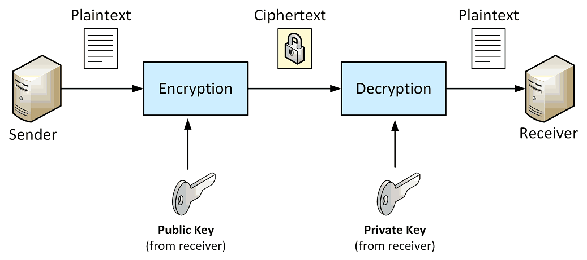

# Asymmetric Key Cryptography

The problem posed with symmetric key ciphers is how to get the secret key to the recipient so that the
recipient can decrypt the ciphertext when it is received.

Asymmetric key cryptography is one answer.
It is called asymmetric key cryptograthy because **the keys used for performing encryption and decryption are
different** and are normally reffered to as **public and private keys**.

The most popular asymmetric cipher algorithm is **RSA** which was initially publicized in 1977 by 
Ronals **R**ivest, Adi **S**hamir, and Leonard **A**dleman.

**The algoritm gets its security from the difficulty of factoring large numbers.**
Essentially, the public and private keys are functions of a pair of large primes, 
and recovering the plaintext from a given ciphertext and the public key used to create it is believed to be 
equivalent to the problem of recovering the primes used to make they keys.  

## Creating Random RSA Keys
We can use the `KeyPairGenerator` class to generate a `KeyPair`. **Key sizes should be between 2048 or 4096 bits.**

The `KeyPair` class serves as a holder for a private key and its associated public key. The `getPrivate()` and 
`getPublic()` methods return the private and public key keys.

## References

* David Hook. **Beginning Cryptography with Java**. Wrox, 2005
    Chapter 4: Asymmetric Key Cryptography

* [RSA Signing and Encryption in Java](https://niels.nu/blog/2016/java-rsa.html)
  

*Egon Teiniker, 2020 - 2021, GPL v3.0* 
