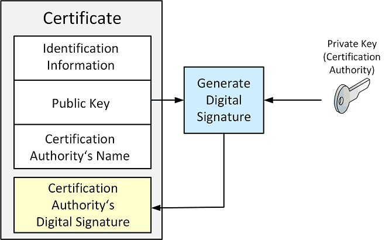

# Digital Certificates

A digital certificate is a document that uniquely identifies information about a party.
It contains a party's **public key plus other information** that is digitally signed and issued by a trusted third party,
also reffered to as a **Certificate Authority (CA)**.

A digital certificate is also known as an **X.509 certificate** and is commonly used to solve problems associated
with key management.

A digital certificate contains a **public key**, **identification information** and the **name of the CA**.
The CA uses its private key to signe the certificate. The **CA signature** is also added to the certificate.

## References

* David Hook. **Beginning Cryptography with Java**. Wrox, 2005
    Chapter 6: Distinguished Names and Certificates
    
*Egon Teiniker, 2020 - 2021, GPL v3.0* 