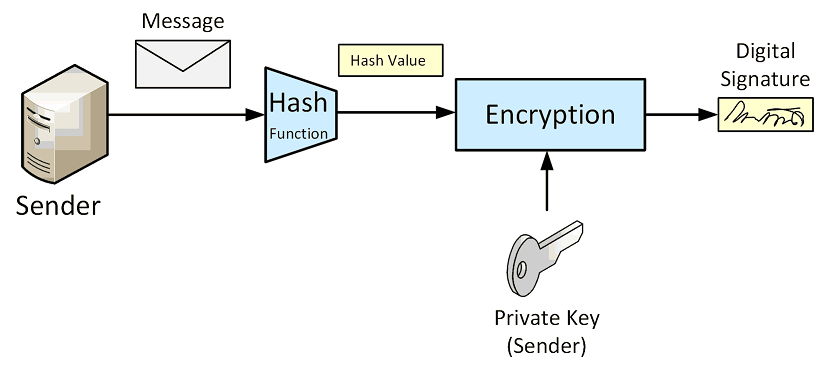

# Digital Signatures

A digital signature is created using some secret known only to the creator of a signature. 
The digital signature can be verified using public information published by the signature creator.

Digital signature algorithms are based on the use of cryptographic hashes.
**We sign a message with our private key and verify the signature with the public key.**
This allows us to make sure that a message comes from the creator of our public key (the private key holder) and that 
it wasn’t tampered with in transit.

There are two processes that are associated with digital signatures:

* **Signature construction**: We get a Signature object of type **SHA256withRSA**, initialize it with the private key, 
    updated it with all the bytes in our message and then generate a signature with the `sign()` method.

* **Signature verification**: We get a Signature instance, set it up to verify with the public key, feed it all the 
    plain text bytes and then use the signature bytes to see if the signature matches.
    This verify method returns a boolean indicating whether the signature is valid or not.

## References

* David Hook. **Beginning Cryptography with Java**. Wrox, 2005.
    Chapter 4: Asymmetric Key Cryptography

* [RSA Signing and Encryption in Java](https://niels.nu/blog/2016/java-rsa.html)

*Egon Teiniker, 2020 - 2021, GPL v3.0* 