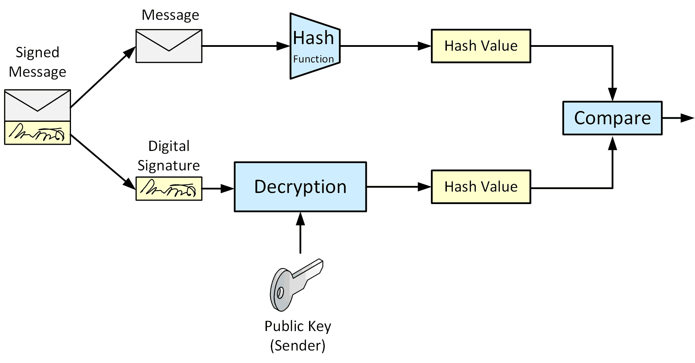

# Digital Signatures

A digital signature is a cryptographic mechanism used to **verify the 
authenticity and integrity of digital data or messages**. It is the digital 
equivalent of a handwritten signature or a stamped seal, but it is much 
more secure because it relies on mathematical algorithms.

Digital signature algorithms are based on the use of cryptographic hashes.
**We sign a message with our private key and verify the signature with the public key.**
This allows us to make sure that a message comes from the creator of our public key (the private key holder) and that it wasn’t tampered with in transit.

## Process of Signing

* **Hashing**: A hash function (e.g., SHA-256) is applied to the message or document, 
    producing a fixed-size hash value (digest).
    The hash is unique to the data, meaning any change to the data will result 
    in a different hash.

* **Encrypting with the Private Key**: The hash is encrypted using the signer’s 
    private key to create the digital signature.
    This binds the signature to both the data and the signer.

## Process of Verification

* **Decrypting with the Public Key**: The recipient uses the signer’s public 
    key to decrypt the signature, revealing the original hash.

* **Recomputing the Hash**: The recipient independently computes the hash of 
    the received data.

* **Comparing Hashes**: If the decrypted hash matches the recomputed hash, 
    the signature is valid, confirming the data's integrity and the signer's 
    authenticity.

## Applications of Digital Signatures

* **Secure Communication**: Ensures authenticity and integrity of emails, 
    files, and transactions.

* **Legal Documents**: Used in e-signatures for contracts, agreements, 
    and official records.

* **Cryptocurrencies**: Essential for verifying transactions in blockchain 
    systems.

## References

* David Hook. **Beginning Cryptography with Java**. Wrox, 2005.
    Chapter 4: Asymmetric Key Cryptography

* [RSA Signing and Encryption in Java](https://niels.nu/blog/2016/java-rsa.html)

*Egon Teiniker, 2016-2024, GPL v3.0* 