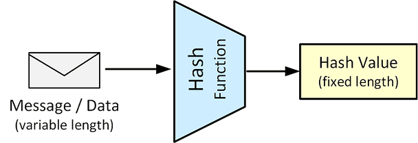

# Message Digest 

Message digests compute a **cryptographic hash**, or secure checksum, for a particular message.



Depending on the message size and the type of digest being used, the chances of generating the 
same message digest is extremely small.
Changing a bit in the input message for which a digest has been computed will lead to an unpredictable 
change in the bits making up the new digest if the calculation is done again.
This property of **uniqueness** and the **lack of predictability** make message digest a very useful part 
of any cryptographic toolbox.

Hash values can be used for:
* **Verify data integrity**: 
  When we download a binary file, the website hosting the download often publishes a checksum 
  on the site as well. We can generate a hash value of our downloaded file and ensure that it 
  matches the values published on the download site. If the values match, we have verified that 
  the downloaded file contains valid data.

* **Store user passwords**: 
  Security best practice state that user passwords should only be known by the user himself. 
  This can be accomplished by storing the hash value of the user’s password instead of the 
  password itself.

## MessageDigest in Java
In Java we can use the static `getInstance()` method to create a new `MessageDigest` object 
using a particular algorithm.

_Example_: Calculate SHA256 Message Digest
```Java
    MessageDigest digest = MessageDigest.getInstance("SHA-256");
    digest.update(inputBytes);
    byte[] bytes = digest.digest();
```

The `update()` method is used to feed data into the digest.
There is no return value because the input data is stored in the MessageDigest object.

The `digest()` method closes the calculation and returns the final digest value.

The data is processed through it using the `update()` methods. 
At any point `reset()` can be called to reset the digest. 
Once all the data to be updated has been updated, one of the `digest()` methods should be 
called to complete the hash computation.

The `digest()` method can be called once for a given number of updates. 
After `digest()` has been called, the `MessageDigest` object is reset to its initialized state.


## OpenSSL: Generate a message digest of a file
The digest functions output the message digest of a supplied file or files in hexadecimal.

To see the list of supported algorithms, use the `list --digest-commands` command.
```
$ openssl list -digest-commands
blake2b512        blake2s256        gost              md4               
md5               rmd160            sha1              sha224            
sha256            sha3-224          sha3-256          sha3-384          
sha3-512          sha384            sha512            sha512-224        
sha512-256        shake128          shake256          sm3   
```

```
$ openssl dgst -sha256 wordlist.txt 
SHA256(wordlist.txt)= fd17b0ff31d7fb7b4e202b0cd99e1f11aa1f4972aab81010544a4e562f42bac7
```

## Referecnes
* [Java API: Class MessageDigest](https://docs.oracle.com/en/java/javase/17/docs/api/java.base/java/security/MessageDigest.html)
* [Java API: MessageDigest Algorithms](https://docs.oracle.com/en/java/javase/17/docs/specs/security/standard-names.html#messagedigest-algorithms)

* [YouTube (Christof Paar): Hash Functions](https://youtu.be/tLkHk__-M6Q)

* David Hook. **Beginning Cryptography with Java**. Wrox, 2005
    * Chapter 3: Message Digest; MACs, and HMACs

* [openssl](https://www.openssl.org/docs/man1.1.1/man1/openssl.html)

*Egon Teiniker, 2016 - 2022, GPL v3.0* 