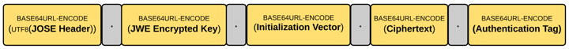

# JSON Web Encryption (JWE)

JSON Web Encryption (JWE) provides confidentiality and integrity protection to 
content, using a number of common cryptographic algorithms, such as RSA and AES.

The message to be encrypted using JWE standard needs not to be a JSON payload, 
it can be any content.

With the **JWE compact serialization**, a JWE token is built with five key 
components, each separated by a period (.): 


* **JOSE header**: The JOSE header is the very first element of the JWE token produced under compact serialization. The structure of the JOSE header is the same, as we discussed under JWS other than couple of exceptions.

* **JWE Encrypted Key**: The token issuer generates a random key and encrypts the message using 
  that key. Next, the key used to encrypt the message is encrypted. 

* **JWE initialization vector**: To decrypt the message, the reciver has to know the initialization 
   vector, therefore it is included in the JWE token.

* **JWE Ciphertext**: The fourth element of the JWE token is the base64url-encoded value of the JWE 
  ciphertext. The JWE ciphertext is computed by encrypting the plaintext JSON payload.

* **JWE Authentication Tag**: The value of the authentication tag is produced during the 
    encryption process, along with the ciphertext. 
    The authentication tag ensures the integrity of the ciphertext.

_Example_: JWE using **Advanced Encryption Standard (AES)** in **Galois/Counter Mode (GCM)** 
 algorithm with a **128-bit** long key 
``` 
    eyJlbmMiOiJBMTI4R0NNIiwiYWxnIjoiZGlyIn0.
    .
    0Ff8tNhDqnSzsXDG.
    RWnsZX6v2JnPEtfuea8h0NGs3rNcDe7wd4Zx.
    Wo642cKkds8q0S65Fv8mOw
```

## Direct JSON Web Encryption (JWE) with a shared symmetric key
The simplest kind of encryption available in the JSON Web Encryption (JWE) 
standard is **direct encryption with a shared symmetric key**. 
The content is encrypted directly with the symmetric key, using a method such 
as **AES/GCM**, hence the name of the algorithm.


## References 
* [RFC 7516 - JSON Web Encryption (JWE) ](https://tools.ietf.org/html/rfc7516)
* [Direct JSON Web Encryption (JWE) with a shared symmetric key](https://connect2id.com/products/nimbus-jose-jwt/examples/jwe-with-shared-key)
* [JWT, JWS and JWE for Not So Dummies!](https://medium.facilelogin.com/jwt-jws-and-jwe-for-not-so-dummies-b63310d201a3)