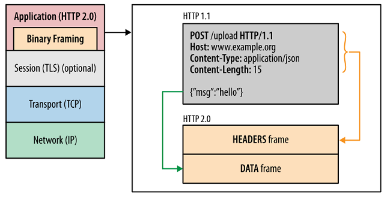

# HTTP/2 Protocol

The primary goals for HTTP/2 are to reduce latency by enabling **full request and response multiplexing**, 
minimize protocol overhead via **efficient compression of HTTP header fields**, and add support for 
**request prioritization** and **server push**. 

HTTP/2 introduces a new **binary framing layer** that is not backward compatible with previous HTTP/1.x servers 
and clients—hence the major protocol version increment to HTTP/2.

Unless we are implementing a web server (or a custom client) by working with raw TCP sockets, then we 
won’t see any difference: all the new, low-level framing is performed by the client and server on your behalf. 
The only observable differences will be improved performance and availability of new capabilities like request 
prioritization, flow control, and server push.
 
**HTTP/2 does not modify the application semantics of HTTP** in any way. All the core concepts, 
such as HTTP methods, status codes, URIs, and header fields, remain in place. 
Instead, HTTP/2 modifies how the data is formatted (framed) and transported between the client and server, 
both of which manage the entire process, and hides all the complexity from our applications within the 
new framing layer. As a result, **all existing applications can be delivered without modification**.

## Binary Framing Layer 

At the core of all performance enhancements of HTTP/2 is the new binary framing layer, which dictates how the 
HTTP messages are encapsulated and transferred between the client and server.

The HTTP semantics, such as verbs, methods, and headers, are unaffected, but the way they are encoded while 
in transit is different. 
Unlike the newline delimited plaintext HTTP/1.x protocol, all HTTP/2 communication is split into smaller **messages** 
and **frames**, each of which is **encoded in binary format**.

As a result, both client and server must use the new binary encoding mechanism to understand each other: 
an HTTP/1.x client won’t understand an HTTP/2 only server, and vice versa.

### Streams, Messages, and Frames

To describe this process, we need the following HTTP/2 terminology:
* **Stream**: A bidirectional flow of bytes within an established connection, which may carry one or more messages.

* **Message**: A complete sequence of frames that map to a logical request or response message.

* **Frame**: The smallest unit of communication in HTTP/2, each containing a frame header, which at a minimum 
    identifies the stream to which the frame belongs.

## References

* [Youtube: HTTP/2 101](https://youtu.be/r5oT_2ndjms)

* [Introduction to HTTP/2](https://developers.google.com/web/fundamentals/performance/http2)

* [RFC7540: Hypertext Transfer Protocol Version 2 (HTTP/2)](https://datatracker.ietf.org/doc/html/rfc7540)

*Egon Teiniker, 2019-2021, GPL v3.0*