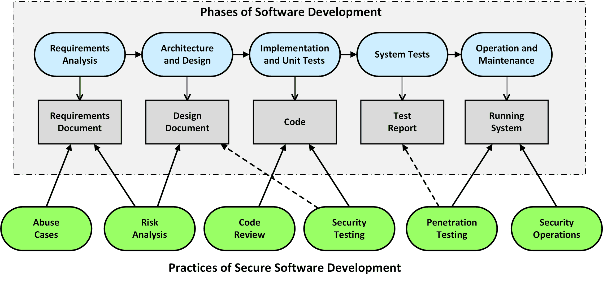

# Introduction to Software Security

## Information Security

> Information security is defined as **protecting information and information systems** 
> from unauthorized access, use, disclosure, disruption, modification, or destruction.

We want to **protect our data and systems** from those who seek to misuse them, 
intentionally or unintentionally, or those who should not have access to them.

**No single activity or action will make you secure in every situation**.

Three of the **primary concepts in information security** are:
* **Confidentiality** refers to our ability to protect our data from those 
    who are not authorized to view it.
* **Integrity** is the ability to prevent people from changing your data in 
    an unauthorized or undesirable manner.
* **Availability** refers to the ability to access our data when we need it.

We can place **attacks** into one of four categories: 
* **Interception attacks** allow unauthorized users to access our data, 
    applications, or environments, and they are primarily attacks against 
    confidentiality. When they’re properly executed, interception attacks 
    can be difficult to detect.

* **Interruption attacks** make your assets unusable or unavailable to you 
    on a temporary or permanent basis. These attacks often affect availability 
    but can affect integrity.

* **Modification attacks** involve tampering with an asset. Such attacks 
    might primarily be considered attacks on integrity but could also 
    represent attacks on availability.

* **Fabrication attacks** involve generating data, processes, communications, 
    or other similar material with a system. Fabrication attacks primarily 
    affect integrity but could affect availability.

In the context of attacks, we distinguish between:
* A **threat** is something that has the potential to cause harm.
* **Vulnerabilities** are weaknesses, or holes, that threats can 
    exploit to cause you harm.
* **Risk** is the likelihood that something bad will happen.

The best strategy is to spend our time mitigating the most likely attacks 
(the ones with the highest risks).

## Secure Software Development Lifecycle

In order to develop a secure software system, several security-related 
activities must be carried out in different phases of software development.

Existing process models of software development have therefore been expanded 
to include specific security activities that take security into account in 
every development phase.

The best-known representatives of these extended process models are: 
* The **Security Development Lifecycle (SDL)** from Microsoft 
* The **Touchpoints for Software Security** from Gary McGraw

_Figure: (McGraw, 2006)_

1. **Abuse Cases**: To bring software security into the development process 
    as early as possible, we should consider **any requirement** for 
    ** how it could be misused** by a hacker. 
    Such scenarios are called Abuse Cases. 
    
    The advantage of explicit abuse cases is that they can already be considered 
    in the architecture and design phase - evaluated and prioritized.
    
    To bring in this hacker perspective, we can put **security experts** 
    into the team.
    For smaller projects, we can use known **attack patterns** (OWASP Top 10) 
    and integrate them into the requirements analysis.

2. **Architectural Risk Analysis**: In addition to implementation-level bugs, 
    architectural and **design flaws** cause the most security holes in software 
    systems.
    
    A variant of the risk analysis is the **threat modeling**: The system is 
    analyzed from the perspective of a hacker to find possible entry points, 
    which then can be used to accessed the desired assets. 
    Such attack goals are then called threats. 
    If there are no sufficient safeguards for a given threat, we have found 
    a **vulnerability**.

    The results of a risk analysis should have a direct impact on the architecture 
    and design phase of software development.

3. **Code Review**: The entire structure and functionalities of a software system 
    can be read in the source code. The focus of the code review lies on those 
    **implementation errors** that can be exploited as a security vulnerability. 

    * **Manual reviews** are very time consuming and error prone, so they are only 
        suitable for **small code fragments** and training purposes. 
    * **Automated reviews** are performed using static analysis tools. These tools 
        create a model from the given code and then look for **error patterns** using 
        **predefined rules**. The results of analysis tools must always be manually 
        reviewed and prioritized to separate relevant bugs from less important warnings.

4. **Risk-Based Security Testing**: Based on the results of the risk analysis, 
    automated tests can check whether these vulnerabilities can be successfully 
    attacked.
    
    We can also use automated testing to verify built-in security mechanisms, 
    for example: the validation of input data.
    
    Technically, **unit-**, **integration-**, and **system tests** are used.
    While unit, component and integration tests can be automated very well with 
    regular xUnit test frameworks, security system tests usually rely on tools 
    that use known attack patterns - **active scanner**.

5. **Penetration Testing**: After a software system has been installed in its 
    **final runtime environment**, hacker attacks can be simulated. 
    
    It is a **blackbox test** based on tools and techniques used by hackers.
    
    When penetration testing is used as part of the development process, it 
    focuses on the **scanning and exploitation** activities because it is primarily 
    about detecting and identifying security holes. 
    
    Alternatively, penetration tests are used to get an **initial overview of the vulnerabilities** of an existing application.

6. **Secure Operations**: When a software system has been fully developed, 
    it will be installed in the final runtime environment - **deployment**. 
    
    From the point of view of software security, it is fundamentally important 
    that the **configurations** for operating system, network, application server 
    and web server etc. are carried out correctly and the latest **updates and 
    patches** are installed.
    
    In addition, administrators often have great expertise in hacker attacks. 
    They oversee and monitor **intrusion detection systems, event logs**, and 
    **deal with vulnerabilities** in many applications over the years.

The time at which a security analysis takes place has a significant influence 
on the order of the practices used:
* If a software system is **developed from scratch**, security problems must 
    be removed as early as possible during development. 
    The practices of secure software development are applied along the phases 
    of software development.

* If an **existing software system** is analyzed, often a penetration test is 
    used first. The additional use of code review and architectural risk 
    analysis is recommended in order to fully discover security issues.

## References

* Jason Andress. **Foundations of Information Security**. No Starch Press, 2019
* Gary McGraw. **Software Security – Building Security In**. Addison-Wesley, 2006

*Egon Teiniker, 2016-2024, GPL v3.0*

