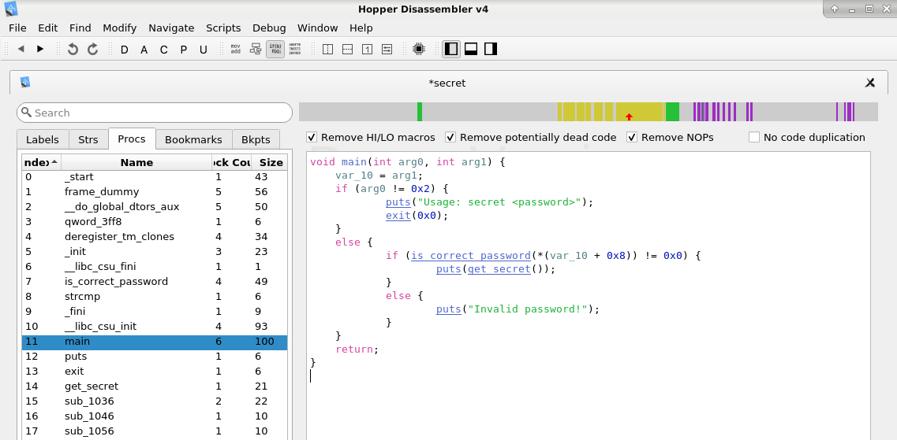

# Example: secret - Static Analysis

Given a simple C program that reads an input string and compares it to
a password. If the strings match, a secret (product key) is shown.
```
$ make
gcc -std=c11 -Wall -o secret secret.c
```
Note that we use the compiler **without debug flag (-g)**.
```
$ ./secret xxxxx
Invalid password!

$ ./secret 6LJ53vc6kFtwY_
ACD0-84F1-9A56-47BC
```
Now, let's use static analysis practices to reverse engineer that binary file to 
find out the hidden secret...


## Static Analysis

Using the tool **file** we can determine the file type of the executable:
```
$ file secret
secret: ELF 64-bit LSB executable, x86-64, version 1 (SYSV), dynamically linked, interpreter /lib64/ld-linux-x86-64.so.2, for GNU/Linux 2.6.32, BuildID[sha1]=b5dfc30bffe9c6bddb31a61aa8ba5e75759e323b, not stripped
```

Using the tool **hexdump** we can display the binary content of the executable
(including ASCII text if we add the `-C` flag).
```
$ hexdump -C secret
00000000  7f 45 4c 46 02 01 01 00  00 00 00 00 00 00 00 00  |.ELF............|
00000010  03 00 3e 00 01 00 00 00  70 10 00 00 00 00 00 00  |..>.....p.......|
00000020  40 00 00 00 00 00 00 00  58 31 00 00 00 00 00 00  |@.......X1......|
...
```

To extract only string literals used in the binary, we can use the command **strings**:
```
$ strings secret
/lib64/ld-linux-x86-64.so.2
libc.so.6
exit
puts
__cxa_finalize
strcmp
__libc_start_main
GLIBC_2.2.5
_ITM_deregisterTMCloneTable
__gmon_start__
_ITM_registerTMCloneTable
u/UH
[]A\A]A^A_
ACD0-84F1-9A56-47BC
6LJ53vc6kFtwY_
Usage: secret <password>
Invalid password!
;*3$"
GCC: (Debian 8.3.0-6) 8.3.0
...
```
These strings could be used in a wordlist file to perform brute force attacks...

Finally, we can disassemble the binary using **objdump**
```
$ objdump -d ./secret | less
...
000000000000116a <is_correct_password>:
    116a:       55                      push   %rbp
    116b:       48 89 e5                mov    %rsp,%rbp
    116e:       48 83 ec 10             sub    $0x10,%rsp
    1172:       48 89 7d f8             mov    %rdi,-0x8(%rbp)
    1176:       48 8b 45 f8             mov    -0x8(%rbp),%rax
    117a:       48 89 c6                mov    %rax,%rsi
    117d:       48 8d 3d 94 0e 00 00    lea    0xe94(%rip),%rdi        # 2018 <_IO_stdin_used+0x18>
    1184:       e8 b7 fe ff ff          callq  1040 <strcmp@plt>
    1189:       85 c0                   test   %eax,%eax
    118b:       75 07                   jne    1194 <is_correct_password+0x2a>
    118d:       b8 01 00 00 00          mov    $0x1,%eax
    1192:       eb 05                   jmp    1199 <is_correct_password+0x2f>
    1194:       b8 00 00 00 00          mov    $0x0,%eax
    1199:       c9                      leaveq 
    119a:       c3                      retq   
...
```

Assembly code is difficult to read, especially when it comes to large binary files. 
Analysis tools such as **Hopper** can be very helpful here.
Hopper can represent a binary in assembly, as data flow graph or pseudocode.



This **pseudocode** is a mixture of C and assembler code that cannot be compiled. 
Nevertheless, this representation makes the analysis much easier.


## References
* [Hopper Disassembler](https://www.hopperapp.com/) the reverse engineering tool that lets you disassemble, decompile and debug your applications.


*Egon Teiniker, 2020-2021, GPL v3.0* 
