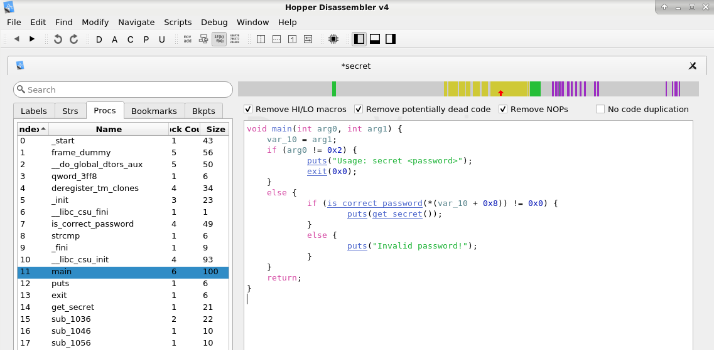

# Example: C Reverse Engineering

Given a simple C program that reads an input string and compares it to
a password. If the strings match, a secret (product key) is shown.
```
$ make
gcc -std=c11 -Wall -o secret secret.c
```
Note that we use the compiler **without debug flag (-g)**.
```
$ ./secret xxxxx
Invalid password!

$ ./secret 6LJ53vc6kFtwY_
ACD0-84F1-9A56-47BC
```
Now, let's reverse engineer that binary file to find out the hidden
secret :-)

## Static Analysis

Using the tool **file** we can determine the file type of the executable:
```
$ file secret
secret: ELF 64-bit LSB executable, x86-64, version 1 (SYSV), dynamically linked, interpreter /lib64/ld-linux-x86-64.so.2, for GNU/Linux 2.6.32, BuildID[sha1]=b5dfc30bffe9c6bddb31a61aa8ba5e75759e323b, not stripped
```

Using the tool **hexdump** we can display the binary content of the executable
(including ASCII text if we add the `-C` flag).
```
$ hexdump -C secret
00000000  7f 45 4c 46 02 01 01 00  00 00 00 00 00 00 00 00  |.ELF............|
00000010  03 00 3e 00 01 00 00 00  70 10 00 00 00 00 00 00  |..>.....p.......|
00000020  40 00 00 00 00 00 00 00  58 31 00 00 00 00 00 00  |@.......X1......|
...
```

To extract only string literals used in the binary, we can use the command **strings**:
```
$ strings secret
/lib64/ld-linux-x86-64.so.2
libc.so.6
exit
puts
__cxa_finalize
strcmp
__libc_start_main
GLIBC_2.2.5
_ITM_deregisterTMCloneTable
__gmon_start__
_ITM_registerTMCloneTable
u/UH
[]A\A]A^A_
ACD0-84F1-9A56-47BC
6LJ53vc6kFtwY_
Usage: secret <password>
Invalid password!
;*3$"
GCC: (Debian 8.3.0-6) 8.3.0
...
```
These strings could be used in a wordlist file to perform brute force attacks...

Finally, we can disassemble the binary using **objdump**
```
$ objdump -d ./secret | less
...
000000000000116a <is_correct_password>:
    116a:       55                      push   %rbp
    116b:       48 89 e5                mov    %rsp,%rbp
    116e:       48 83 ec 10             sub    $0x10,%rsp
    1172:       48 89 7d f8             mov    %rdi,-0x8(%rbp)
    1176:       48 8b 45 f8             mov    -0x8(%rbp),%rax
    117a:       48 89 c6                mov    %rax,%rsi
    117d:       48 8d 3d 94 0e 00 00    lea    0xe94(%rip),%rdi        # 2018 <_IO_stdin_used+0x18>
    1184:       e8 b7 fe ff ff          callq  1040 <strcmp@plt>
    1189:       85 c0                   test   %eax,%eax
    118b:       75 07                   jne    1194 <is_correct_password+0x2a>
    118d:       b8 01 00 00 00          mov    $0x1,%eax
    1192:       eb 05                   jmp    1199 <is_correct_password+0x2f>
    1194:       b8 00 00 00 00          mov    $0x0,%eax
    1199:       c9                      leaveq 
    119a:       c3                      retq   
...
```

Assembly code is difficult to read, especially when it comes to large binary files. 
Analysis tools such as **Hopper** can be very helpful here.
Hopper can represent a binary in assembly, as data flow graph or pseudocode.



This **pseudocode** is a mixture of C and assembler code that cannot be compiled. 
Nevertheless, this representation makes the analysis much easier.


## Dynamic Analysis

Using **strace** we can monitor the interaction between the application and the kernel:
```
$ strace ./secret xxxx
execve("./secret", ["./secret", "xxxx"], 0x7ffd712bb8f8 /* 44 vars */) = 0
brk(NULL)                               = 0x55c505d9e000
access("/etc/ld.so.preload", R_OK)      = -1 ENOENT (No such file or directory)
openat(AT_FDCWD, "/etc/ld.so.cache", O_RDONLY|O_CLOEXEC) = 3
fstat(3, {st_mode=S_IFREG|0644, st_size=94268, ...}) = 0
mmap(NULL, 94268, PROT_READ, MAP_PRIVATE, 3, 0) = 0x7fdef1359000
close(3)                                = 0
openat(AT_FDCWD, "/lib/x86_64-linux-gnu/libc.so.6", O_RDONLY|O_CLOEXEC) = 3
read(3, "\177ELF\2\1\1\3\0\0\0\0\0\0\0\0\3\0>\0\1\0\0\0\260A\2\0\0\0\0\0"..., 832) = 832
fstat(3, {st_mode=S_IFREG|0755, st_size=1824496, ...}) = 0
mmap(NULL, 8192, PROT_READ|PROT_WRITE, MAP_PRIVATE|MAP_ANONYMOUS, -1, 0) = 0x7fdef1357000
...
fstat(1, {st_mode=S_IFCHR|0620, st_rdev=makedev(0x88, 0x2), ...}) = 0
brk(NULL)                               = 0x55c505d9e000
brk(0x55c505dbf000)                     = 0x55c505dbf000
write(1, "Invalid password!\n", 18Invalid password!
)     = 18
exit_group(0)                           = ?
+++ exited with 0 +++
```
There is no file access because the password is hard-coded, thus, we can not see 
much information from system call analysis.

Using **ltrace**, we can trace the interaction between the application and the libraries: 
```
$ ltrace ./secret xxxx
strcmp("6LJ53vc6kFtwY_", "xxxx")  = -66         <= !!!
puts("Invalid password!"Invalid password! 
) = 18
+++ exited (status 0) +++
```

Using the **gdb** we can interactively execute the binary.
Note that we can see the C source code because we did not use the `-g` compiler flag.
```
$ gdb ./secret 
(gdb) disass main
Dump of assembler code for function main:
   0x000000000000119b <+0>:     push   rbp
   0x000000000000119c <+1>:     mov    rbp,rsp
   0x000000000000119f <+4>:     sub    rsp,0x10
   0x00000000000011a3 <+8>:     mov    DWORD PTR [rbp-0x4],edi
   0x00000000000011a6 <+11>:    mov    QWORD PTR [rbp-0x10],rsi
   0x00000000000011aa <+15>:    cmp    DWORD PTR [rbp-0x4],0x2
   0x00000000000011ae <+19>:    je     0x11c6 <main+43>
   0x00000000000011b0 <+21>:    lea    rdi,[rip+0xe70]        # 0x2027
   0x00000000000011b7 <+28>:    call   0x1030 <puts@plt>
   0x00000000000011bc <+33>:    mov    edi,0x0
   0x00000000000011c1 <+38>:    call   0x1050 <exit@plt>
   0x00000000000011c6 <+43>:    mov    rax,QWORD PTR [rbp-0x10]
   0x00000000000011ca <+47>:    add    rax,0x8
   0x00000000000011ce <+51>:    mov    rax,QWORD PTR [rax]
   0x00000000000011d1 <+54>:    mov    rdi,rax
   0x00000000000011d4 <+57>:    call   0x116a <is_correct_password>
   0x00000000000011d9 <+62>:    test   eax,eax                  <= !!!
   0x00000000000011db <+64>:    je     0x11ec <main+81>
   0x00000000000011dd <+66>:    call   0x1155 <get_secret>
   0x00000000000011e2 <+71>:    mov    rdi,rax
   0x00000000000011e5 <+74>:    call   0x1030 <puts@plt>
   0x00000000000011ea <+79>:    jmp    0x11f8 <main+93>
   0x00000000000011ec <+81>:    lea    rdi,[rip+0xe4d]        # 0x2040
   0x00000000000011f3 <+88>:    call   0x1030 <puts@plt>
End of assembler dump.
```

We set a breakpoint to analyze the value of the **EAX register** after the
invocation of the **is_correct_password** function with a wrong password.
```
(gdb) break *0x00000000000011d9

(gdb) run xxxx

(gdb) print $eax
$1 = 0

(gdb) continue
Continuing.
Invalid password!
```

Now let's do the same but **manipulate the value of the EAX register**.
```
(gdb) run xxxx

(gdb) set $eax = 1
(gdb) print $eax
$3 = 1

(gdb) continue
Continuing.
ACD0-84F1-9A56-47BC
```
Note that we have changed the control flow of the application by setting
a register value. In other words, if we change the code of the binary at 
that point we could bypass the password check. 

An alternative approache is to **modify the Instruction Pointer RIP** directly:
```
(gdb) run xxxx
Breakpoint 1, 0x00005555555551d9 in main ()

(gdb) disass
Dump of assembler code for function main:
   0x000055555555519b <+0>:     push   rbp
   0x000055555555519c <+1>:     mov    rbp,rsp
   0x000055555555519f <+4>:     sub    rsp,0x10
   0x00005555555551a3 <+8>:     mov    DWORD PTR [rbp-0x4],edi
   0x00005555555551a6 <+11>:    mov    QWORD PTR [rbp-0x10],rsi
   0x00005555555551aa <+15>:    cmp    DWORD PTR [rbp-0x4],0x2
   0x00005555555551ae <+19>:    je     0x5555555551c6 <main+43>
   0x00005555555551b0 <+21>:    lea    rdi,[rip+0xe70]        # 0x555555556027
   0x00005555555551b7 <+28>:    call   0x555555555030 <puts@plt>
   0x00005555555551bc <+33>:    mov    edi,0x0
   0x00005555555551c1 <+38>:    call   0x555555555050 <exit@plt>
   0x00005555555551c6 <+43>:    mov    rax,QWORD PTR [rbp-0x10]
   0x00005555555551ca <+47>:    add    rax,0x8
   0x00005555555551ce <+51>:    mov    rax,QWORD PTR [rax]
   0x00005555555551d1 <+54>:    mov    rdi,rax
   0x00005555555551d4 <+57>:    call   0x55555555516a <is_correct_password>
=> 0x00005555555551d9 <+62>:    test   eax,eax
   0x00005555555551db <+64>:    je     0x5555555551ec <main+81>
   0x00005555555551dd <+66>:    call   0x555555555155 <get_secret>    <= !!!
   0x00005555555551e2 <+71>:    mov    rdi,rax
   0x00005555555551e5 <+74>:    call   0x555555555030 <puts@plt>
   0x00005555555551ea <+79>:    jmp    0x5555555551f8 <main+93>
   0x00005555555551ec <+81>:    lea    rdi,[rip+0xe4d]        # 0x555555556040
   0x00005555555551f3 <+88>:    call   0x555555555030 <puts@plt>
   0x00005555555551f8 <+93>:    mov    eax,0x0
   0x00005555555551fd <+98>:    leave  
   0x00005555555551fe <+99>:    ret    
End of assembler dump.

(gdb) set ($rip)=0x00005555555551dd
(gdb) print $rip
$4 = (void (*)()) 0x5555555551dd <main+66>

(gdb) continue
Continuing.
ACD0-84F1-9A56-47BC
```

## References
* [Hopper Disassembler](https://www.hopperapp.com/) the reverse engineering tool that lets you disassemble, decompile and debug your applications.


*Egon Teiniker, 2020, GPL v3.0* 
