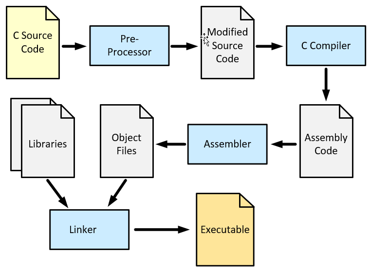

# From C Source Code to an Executable

## One Step Build 

We start our journey with a simple C source code example:
```C
#include <stdio.h>
 
int main()
{
    for(int i=0; i<10; i++)
    {
       printf("Hello world!\n");
    }
    return 0;
}
```

Such a simple C program can be compiled into an executable with one command.
This is also the command that the Code Runner executes in VS Code.

```
$ gcc -std=c99 -g -Wall -o hello hello.c
```

To start the executable, type:
```
$ ./hello
```


## Detailed Build Process 

In fact, the path from C source code to an executable includes several intermediate steps.



### C Preprocessor
The preprocessor modifies the source code on a text basis (`#` commands). Header files are integrated, macros are replaced, etc.

We can start the preprocessor as an independent tool called **cpp** and have the output written to its own file.

```
$ cpp hello.c _hello.c 
```

After the preprocessor has run, all the information the compiler needs is in one file: `_hello.c`.


### Compile C Code into Assembly Code

The file generated by the proprocessor can be translated by the **C compiler** into assembler code for the respective platform.

```
$ gcc -std=c99 -S _hello.c
```

Assembly code is not machine code. It is a human-readable form of machine code in an ASCII file: `_hello.s`.


### Convert Assembly Code to an Object File

An **assembler** called **as** translates assembly code into machine language. 
A binary file is created, the so-called **object file**.

Run the assembler
```
$ as -o hello.o _hello.s
```

Although the object file `hello.o` is a binary file, it **cannot be executed** yet. 

It is just the binary form of the original C source file and contains 
no startup code or library functions.

A real world program consists of a large number of C files and therefore 
also of many object files.

### Link the Object File into an Executable

The linker connects the object files with the necessary libraries 
(at least the standard library `libc`) to the final executable.

```
$ gcc -o hello hello.o
```

Note that a C library is also just a collection of object files.


### Run the Executable

The generated executable can now be started as before:

```
$ ./hello 
```

Note that the steps presented are always carried out, even if the intermediate files are not saved.


## Debugging

The debugger is not only an important tool in software development, it can also be used for reverse engineering.
For reverse engineering we very often use the **gdb** command directly.

First we have to **compile the source code with debug information** (using the `-g` compiler flag).

```
$ gcc -std=c11 -g -Wall -o hello hello.c
```

After that we can start the `gdb` with the binary.

We use the **Intel syntax** of assembly commands. You can also specify this setting in your own configuration file (`~/.gdbinit`).

```
$ gdb ./hello

(gdb) set disassembly-flavor intel

(gdb) list 
1   #include <stdio.h>
2   
3   int main()
4   {
5       for(int i=0; i<10; i++)
6       {
7           printf("Hello world!\n");
8       }   
9       return 0;
10  }
```

The `list` command displays the source code of the application.

The `disass` command shows the assembly code for a function.

```
(gdb) disass main
Dump of assembler code for function main:
   0x00000000004004d7 <+0>:	    push   %rbp
   0x00000000004004d8 <+1>:	    mov    %rsp,%rbp
   0x00000000004004db <+4>:	    sub    $0x10,%rsp
   0x00000000004004df <+8>:	    movl   $0x0,-0x4(%rbp)
   0x00000000004004e6 <+15>:	jmp    0x4004f6 <main+31>
   0x00000000004004e8 <+17>:	mov    $0x4005a0,%edi
   0x00000000004004ed <+22>:	callq  0x4003f0 <puts@plt>
   0x00000000004004f2 <+27>:	addl   $0x1,-0x4(%rbp)
   0x00000000004004f6 <+31>:	cmpl   $0x9,-0x4(%rbp)
   0x00000000004004fa <+35>:	jle    0x4004e8 <main+17>
   0x00000000004004fc <+37>:	mov    $0x0,%eax
   0x0000000000400501 <+42>:	leaveq
   0x0000000000400502 <+43>:	retq
```

Breakpoints, at which the execution of the program is stopped, can be set with `break`.

`run` starts execution of the program.

After the program has stopped at a breakpoint, you can use `next` to execute individual lines of source code.

```
(gdb) break main
Breakpoint 1 at 0x4004df: file hello.c, line 5.

(gdb) run
Starting program: /home/student/workspace-2014ws-ims14-SWSecurity/c-helloworld/hello 
(gdb) next
(gdb) next
(gdb) next

(gdb) print i
$1 = 1

(gdb) continue
Continuing.
```

The content of variables can be output with `print`.

`continue` runs the program to the next breakpoint or to the end.

The debugger is ended with `quit`.

```
(gdb) quit
```

The debugger is a very powerful tool for reverse engineering, since it allows you to analyze the execution of programs and change values of variables, memory contents and registers.

## References

* K. N. King. **C Programming, A Modern Approach.** W. W. Norton & Company, inc. 2nd Edition 2008. 
    * Chapter 14: The Preprocessor

*Egon Teiniker, 2020-2022, GPL v3.0*
