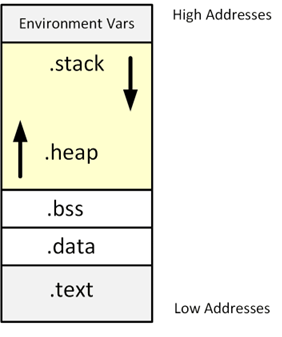

# Memory Segments

## Introduction 
A compiled program's memory is divided into five segments:

* The **.text** segment (or code segment) is where the assembled machine language instructions 
of the program are located.

This memory segment has a **fixed size**.

* The data and bss segments are used to store global and static program variables. The **.data**
segment is filled with the initialized global and static variables, while the **.bss** segment is filled with their uninitialized counterparts.

Although these segments are writable, they also have a **fixed size**.

* The **.heap** segment is a segment of memory a programmer can directly control. 
Blocks of memory in this segment can be allocated and used for whatever the programmer might need. 

The heap segment is not of fixed size, so it **can grow larger or smaller** as needed. 

* The **.stack** segment is used to store local function variables and context during function calls. When a program calls a function that function will have its own set of passed variables. 

The stack is also **not of a fixed size**.

In compiler languages like C, the **compiled code goes into the .text segment**, while the variables reside in the remaining segments:

* Variables that are defined outside of any functions are considered to be **global variables**.    
The **static keyword** can also be used to any variable declaration to make the variable static.If static or global variables are initialized with data, they are stored in the **.data** memory segment, otherwise, these variables are put in the **.bss** memory segment. 
    
* Memory on the .heap memory segment must be allocated using a memory allocation function called `malloc()`. 

* The remaining **function variables** are stored in the **.stack** memory segment. 
Since the stack can contain many different stack frames, stack variables can maintain uniqueness within different functional contexts.

_Example_: [Pointers in C](c-pointers/)

_Example_: [Memory Segments used in C](c-memory-segments/)

## Using the Heap Segment

[Read more...](heap/)

## Using the Stack Segment

[Read more...](stack/)

## References
* Brian W. Kernighan, Dennis M. Ritche. The C Programming Language. Prentice Hall, 2nd Edition, 1988
* Jon Erickson. Hacking - The Art of Exploitation. No Starch Press, 2nd Edition, 2008

*Egon Teiniker, 2020-2022, GPL v3.0*
