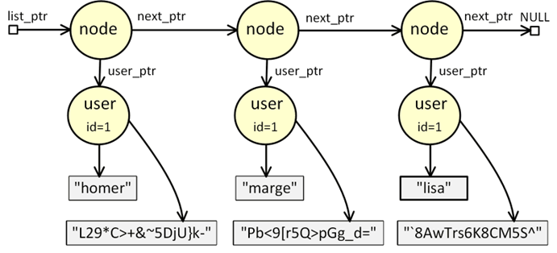

# Using the Heap

**Allocating memory** on the heap is done using the `malloc()` function. 
This function accepts a size as its only argument and reserves that much space in the heap segment, returning the address to the start of this memory as a void pointer. 
If the `malloc()` function can't allocate memory for some reason, it will simply return a NULL pointer.

The corresponding **deallocation** function is `free()`. 
This function accepts a pointer as its only argument and frees that memory space on the heap so it can be used again later.

When using the heap memory, it is important to pay attention to where memory 
is allocated and where memory is freed. **There must be no memory leaks**.

_Example_: [Structures in C ](c-struct/)

_Example_: [Programming the Heap](c-heap/)

The heap segment is used in programs to implement **dynamic data structures**. 
These data structures grow as needed by constantly reserving new memory on 
the heap.

_Example_: [Linked List (Principle)](c-linked-list/)

_Example_: [Linked List](c-linked-list-api/)

_Exercise_: [Lined List for Users](c-linked-list-user-exercise/) ([Model Solution](c-linked-list-user/))

_Exercise_: [Stack](c-stack-exercise/) ([Model Solution](c-stack/))

_Exercise_: [Queue](c-queue-exercise/) ([Model Solution](c-queue/))

_Example_: [Binary Tree](c-binary-tree/)

_Exercise_: [Binary Search Tree](c-binary-search-tree-exercise/) ([Model Solution](c-binary-search-tree/))

## References
* Brian W. Kernighan, Dennis M. Ritche. The C Programming Language. Prentice Hall, 2nd Edition, 1988
* Jon Erickson. Hacking - The Art of Exploitation. No Starch Press, 2nd Edition, 2008

*Egon Teiniker, 2020-2022, GPL v3.0*
