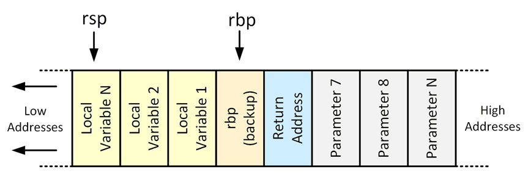

# Using the Stack

## Introduction

The stack is a data structure that has the quality of a **first in, last out (FILO)** queue. The task of putting items on the stack is called a push. The task of taking an item from the stack is called a pop.

Each process maintains its own stack within the **stack segment of memory**. 
The stack **grows backward from the highest memory addresses to the lowest**.

Two important registers deal with the stack: 
* **base pointer (rbp)**: The base pointer is conventionally used to mark the **start of a function's stack frame**, or the area of the stack managed by that function. 

* **stack pointer (rsp)**: Points to the last value pushed onto the stack.


## x86 Calling Conventions

### Function calling procedure

* The program places the **first six integer or pointer parameters** in the registers **rdi, rsi, rdx, rcx, r8, and r9**. Subsequent parameters are pushed onto the stack.

* The program then executes the **call** instruction, which will **push the return address** onto the stack and **jump to** the start of the **specified function**.

* If the function has a **return value**, it will be stored in the rax register after the function call.




### Function prolog
The called function’s responsibilities are first to save the calling program’s `rbp` register on the stack, then to save the current `rsp` register to the `rbp` register (setting the current stack frame).
After that, the function gets an opportunity to execute its statements.


### Function epilog

The last thing a called function does before returning to the calling program is to clean up the stack by removing the `rbp`. Then the saved return address is popped off the stack and saved to the `rip` register as part of the return process.

_Example_: [Function calls in C](c-function-call/)


## Recursion

Recursion is a powerful principle that allows something to be defined in terms of smaller instances of itself.

In computing, recursion is supported via recursive functions.
A recursive function is a function that calls itself. 
Each successive call worls on a more refined set of inputs, bringing us closer and closer to the solution of a problem.

_Example_: Factorial of a number n
```C
int fact(int n)
{
    if(n < 0)
        return 0;
    else if(n == 0 || n == 1)
        return 1;
    else
    {
        return n * fact(n-1);
    }
}
```
The **factoral of n**, written **n!**, is the product of all numbers from `n` down to `1`.
Another way to look at this problem is to define n! as the product of smaller factorials. 
To do this, we define `n!` as n times the factorial of `(n-1)`.

There are two basic phases in a recursive process:
* In the **winding phase**, each recursive call preserve the recursion by making an additional recursive call itself.
    The winding phase terminates when one of the calls reaches a **terminating condition**.
    A terminating condition defines the state at which a recursive function sgould return instead of making another 
    recursive call.
    Every recursive funstion must have at least one terminating condition, otherwise, the winding phase never terminates.

* Once the winding phase is complete, the process enters the **unwinding phase**, in which previous instances of the 
    function are revisited in reverse order.
    This phase continues until the original call returns, at which point the recursive process is complete.

_Examples_: [Factorial](c-factorial/)


_Examples_: [Linked List](c-linked-list-recursion/)


However, stack usage does have a few **drawbacks**:
* Maintaining information about every function call until it returns takes a considerable amount of **memory space**.
* Generating and destroying stack frames takes **CPU time**. Thus, if the overhead associated with these concerns becomes 
too great, we may need to consider an iterative approach (loops).


## References
* [A brief introduction to x86 calling conventions](https://codearcana.com/posts/2013/05/21/a-brief-introduction-to-x86-calling-conventions.html)

* [Youtube: CS50 - Call Stacks](https://youtu.be/aCPkszeKRa4)

* [Youtube: CS50 - Recursion](https://youtu.be/mz6tAJMVmfM)

* Kyle Loudon. Mastering Algorithms with C. O'Reilly,1999
    * Chapter 3: Recursion

*Egon Teiniker, 2020-2022, GPL v3.0*
