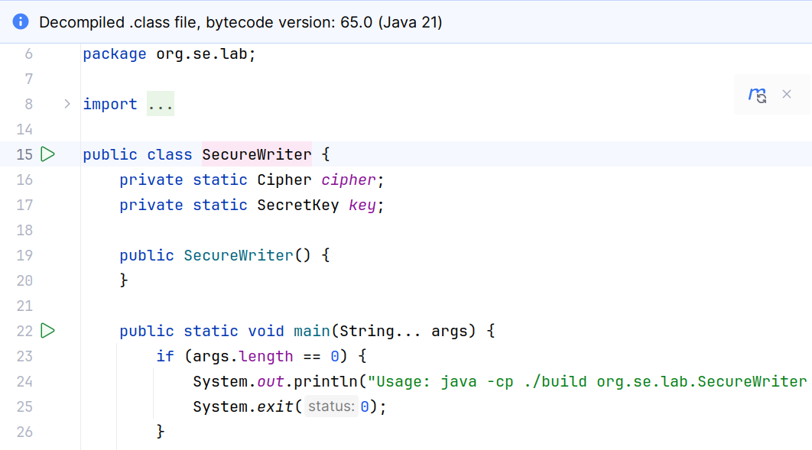

# Example: Decompile Java Class File - Secure Writer

The given implementation reads a text from the command line, encrypts it
and prints the encrypted version of the text back to the console window.

_Example_: Encrypt the given string
```  
    $ mvn compile
	
    $ java -cp ./target/classes org.se.lab.SecureWriter Hello
	559a15168f732657947cc6fd64cbfe98
```

Attackers can use a **Java Decompiler** to analyze and modify the 
compiled class file:

* Use a decompiler to generate Java source code from the `SecureWriter.class`
file:



* Create a new source file, analyze and modify it:
```  
$ mkdir tmp
$ cd tmp 
$ touch SecureWriter.java  # Copy source code into this file
```  

```Java
    public static void main(String... args) {
        if (args.length == 0) {
            System.out.println("Usage: java -cp ./build org.se.lab.SecureWriter <text>");
            System.exit(0);
        }

        try {
            // key = KeyGenerator.getInstance("AES").generateKey();
            // cipher = Cipher.getInstance("AES");
            // byte[] message = encrypt(args[0]);
            // String text = Utility.convertToHexString(message);
            System.out.println(args[0]);
        } catch (Exception e) {
            System.err.println(e.getMessage());
        }
    }
``` 

* Recompile the modified source file and run the new `SecureWriter.class` file:

```
$ javac -cp ../target/classes/ -d . SecureWriter.java

$ java -cp . org.se.lab.SecureWriter Hello
Hello
```

* Override the original class file and remove the temporary folder:
```
$ cp org/se/lab/SecureWriter.class ../target/classes/org/se/lab/
$ cd ..
$ rm -rf tmp

$ java -cp ./target/classes org.se.lab.SecureWriter Hello
Hello
```

Notice how easy it is to decompile Java class files.
This is due to the way Java optimizes the bytecode. 
**Most optimizations are done just-in-time at runtime** of the program and 
not at compile time.

When we **start from a JAR file**, we have to extract the `.class` files first,
modify them and create a new JAR file.

*Egon Teiniker, 2016-2024, GPL v3.0*