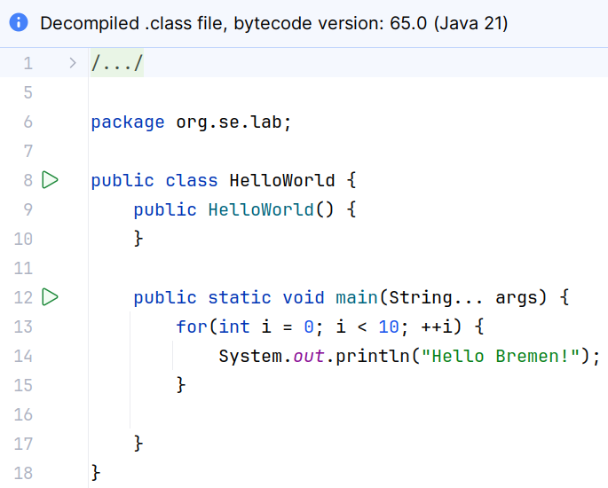

# Java Decompiler 

A Java decompiler is a tool that reverses the process of Java compilation, 
translating compiled Java bytecode back into source code.
This is useful when the original source code is lost or unavailable, as it 
allows developers to recover and understand the logic of Java applications 
from their compiled `.class` files. 

Java decompilers are capable of reconstructing a close approximation of the 
original source code, including structure and syntax, though some details 
like comments and certain variable names may be irretrievable. 

These tools are invaluable for debugging and analyzing how high-level Java 
code is executed at a lower level.

Decompiling is relatively easy in Java due to several key aspects of the 
language and its bytecode:
* **High-Level Bytecode**: Java bytecode is high-level and closely resembles 
the original source code. Unlike machine code, which is highly optimized 
and architecture-specific, Java bytecode retains much of the structure and 
semantics of the Java language, making it easier to translate back into 
source code.

* **Type Information**: Java bytecode includes rich type information. The strong 
and static typing system of Java means that type information is largely preserved 
in the bytecode, aiding decompilers in accurately reconstructing the source code.

* **Standardized Compilation**: The process of compiling Java source code to 
bytecode is standardized and well-documented, leading to a consistent format 
across different compilers. This consistency makes it easier for decompilers 
to predict and interpret the patterns in bytecode.

* **No Obfuscation by Default**: Unless the bytecode has been deliberately 
obfuscated, it generally retains a clear and direct mapping to the source 
code. While obfuscation techniques can make decompilation more difficult, 
standard Java bytecode is usually straightforward to decompile.

These factors combine to make Java bytecode more amenable to decompilation 
compared to other compiled languages, where the original source structure 
and high-level constructs are often lost during the compilation process.

## Online Decompiler 

While JD-GUI only supports JDK-17 code, online decompilers are up to date.

You can simply [upload](https://www.decompiler.com/) a JAR file and the Java 
source code will be displayed.

## Intellij

Intellij can decompile current class files just by double-click on them:

Note that the **decompiled source code is read-only** so we have to copy this 
decompiled code into a new source file.

## References
* [Java Decompiler](http://java-decompiler.github.io/)

* [Online-Decompilers](https://www.decompiler.com/)

*Egon Teiniker, 2016-2025, GPL v3.0*
