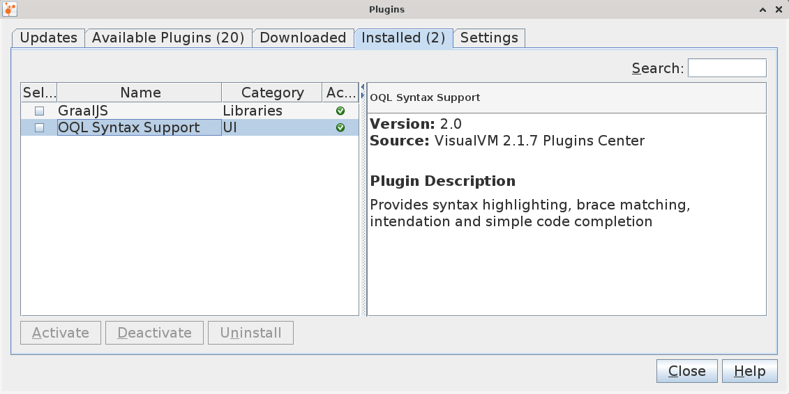

# VisualVM 

VisualVM is a visual tool integrating commandline JDK tools and lightweight 
profiling capabilities.

[Download Standalone: VisualVM](https://visualvm.github.io/)

```
$ cd Downloads
$ unzip visualvm_217.zip 
$ sudo mv visualvm_217 /opt/

$ /opt/visualvm_217/bin/visualvm
```

We can start VisualVM from the command line:
```
$ cd /opt/visualvm_217/
$ bin/visualvm --fontsize 20
```


## Object Query Language (OQL) 

OQL is SQL-like query language to **query Java heap**. 
OQL allows to filter/select information wanted from Java heap.

OQL query is of the form:
```
     select <JavaScript expression to select>
     [ from [instanceof] <class name> <identifier>
     [ where <JavaScript boolean expression to filter> ] ]
```

To use the OQL, install the following plugins:



## References
* [VisualVM - Documentation](https://visualvm.github.io/documentation.html)

*Egon Teiniker, 2020-2023, GPL v3.0*