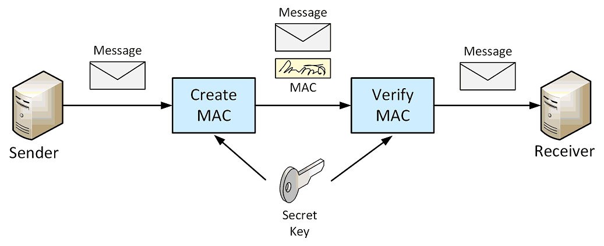

# Message Authentication Code

A Message Authentication Code (MAC) is a short piece of information used to authenticate a message -
to confirm that the message came from the stated sender (its **authenticity**). 
The MAC value protects a message's **data integrity**, as well as its authenticity, by allowing verifiers 
(who also possess the **secret key**) to detect any changes to the message content.

An **Hash-Based Message Authentication Code (HMAC)** is a specific type of MAC involving a cryptographic hash function and 
a secret cryptographic key. 

Any cryptographic hash function, such as SHA-256, may be used in the calculation of an HMAC. 
The resulting MAC algorithm is termed HMAC-X, where X is the hash function used (e.g. HMAC-SHA256 or HMAC-SHA3-256). 

The **cryptographic strength of the HMAC** depends upon the cryptographic strength of the underlying hash function, 
the size of its hash output, and the size and quality of the key.




Essentially, a HMAC is an encrypted checksum generated on the underlying message that is sent along with a message to 
ensure message authentication:
* The sender uses some publicly known HMAC algorithm, inputs the message and the secret key and produces a HMAC value.
* Similar to hash, HMAC functions also compresses an arbitrary long input into a fixed length output. 
  The major difference between hash and HMAC is that HMAC uses secret key during the compression.
* The sender forwards the message along with the HMAC. Here, we assume that the message is sent in the clear, 
  as we are concerned of providing message origin authentication, not confidentiality. 
  If confidentiality is required then the message needs encryption.
* On receipt of the message and the HMAC, the receiver feeds the received message and the shared secret key into the 
  HMAC algorithm and re-computes the HMAC value.
* The receiver now checks equality of freshly computed HMAC with the HMAC received from the sender. If they match, 
  then the receiver accepts the message and assures himself that the message has been sent by the intended sender.
  
_Example:_ HMAC-SHA256
```Java
    Mac hmac = Mac.getInstance("HmacSHA256");
    hmac.init(hmacKey);
    hmac.update(inputBytes);
    byte[] macBytes = hmac.doFinal();
```
The `Mac` class supports either a single-part or multipart operation.
In a **single-part operation**, a single invocation of the `doFinal()` method is required.
**Multipart operations** invoke the `update()` method one or many times, and `doFinal()` method concludes the operation
and resets the engine.		
		
## References 
* [Message Authentication Code](https://en.wikipedia.org/wiki/Message_authentication_code) 
* [Hash-Based Message Authentication Code](https://en.wikipedia.org/wiki/HMAC)
* [Message Authentication](https://www.tutorialspoint.com/cryptography/message_authentication.htm)
* Jason Weiss. **Java Cryptography Extensions**. Morgan Kaufmann, 2004. Chapter 4: Message Digest, Message Authentication, 
and Digital Signatures.

*Egon Teiniker, 2020 - 2021, GPL v3.0* 