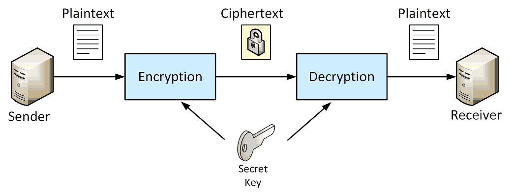

# Symmetric Encryption

A **symmetric cipher** is an algorithm that transforms **plaintext** into **ciphertext** through use of a **secret key**.
Plaintext is a message in its native form - we can simply read it. 
Ciphertext is the result of the encryption operation and appears as a sequence of bytes.
**The secret key is the critical piece in the system**. If the secret key is compromised, then so is the message hidden 
in the ciphertext.

The secret key used to generate the ciphertext is the same secret key used to decipher and return the original plaintext.
The **sender and receiver both use the same secret key**.

Symmetric ciphers are **fast** and capable of performing encryption operations even when the input data is very large.
Some symmetric cipher algorithms lend themselves to parallel encryption operations that can take full advantage 
of multiple CPUs.

Symmetric-key encryption can use either stream ciphers or block ciphers:
* **Block ciphers** take a number of bits and encrypt them as a single unit, padding the plaintext so that it is a multiple 
  of the block size. The [Advanced Encryption Standard (AES)](https://en.wikipedia.org/wiki/Advanced_Encryption_Standard) 
  algorithm uses 128-bit blocks.
* **Stream ciphers** encrypt the digits (typically bytes) of a message one at a time. An example is ChaCha20.

        
## References
* [Symmetric-Key Algorithm](https://en.wikipedia.org/wiki/Symmetric-key_algorithm)
* Jason Weiss. **Java Cryptography Extensions**. Morgan Kaufmann, 2004. Chapter 2: Working with Symmetric Ciphers.

*Egon Teiniker, 2020 - 2021, GPL v3.0* 