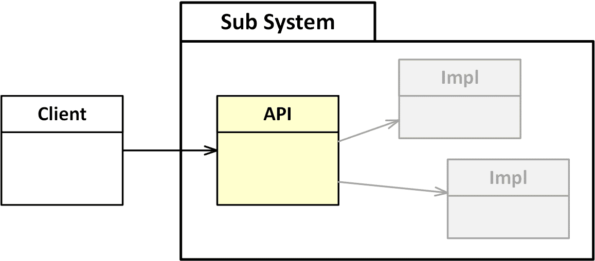

# Encapsulation

A well-designed software module **hides all of its implementation details**, 
clearly separating its API from its Implementation. 
Modules then communicate only through their APIs.

This concept, known as information hiding or **encapsulation**, is also one of 
the fundamental principles of software design.

The following techniques are used to encapsulate data and restrict the visibility of data and functionality:

* [Deep Copy of Mutual Objects](deep-copy/)
* [Immutable Classes](immutable-classes/)
* [Java Reflection API](reflection/)
* [Java Module System](modules/)
* [Java Sealed Classes](sealed-classes/)
* [Object Serialization](serialization/)

## References

* Joshua Bloch. **Effective Java**. Addison-Wesley, 3nd Edition 2017
    * Chapter 4: Classes and Interfaces
    * Chapter 8: Methods 

* Sander Mak, Paul Bakker. **Java 9 Modularity: Patterns and Practices for Developing Maintainable Applications**. O'Reilly, 2017

*Egon Teiniker, 2016-2023, GPL v3.0*